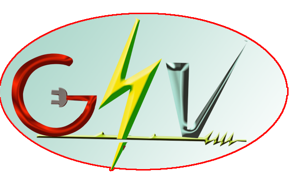

# GSV Office — TrueNAS SCALE App Catalog

## GSV Office — Enterprise Self-Hosted Workspace Platform

All-in-one workspace with:
- 💬 Real-time Team Chat (WebSocket)
- 📁 Document & File Management  
- 🎫 Helpdesk Ticketing
- 💰 Billing & GST Invoicing
- 👥 HR & Employee Management
- 📦 Inventory & Purchase Orders
- 🔍 Audit Logs
- 🖥️ Server Administration

## Add This Catalog to TrueNAS SCALE

1. **Apps → Manage Catalogs → Add Catalog**
2. Fill in:
   - **Name:** `GSV Office`
   - **Repository:** `https://github.com/gsvrnd2025-alt/gsv-office-catalog`
   - **Train:** `stable`
   - **Branch:** `main`
3. Wait ~2 minutes → search **"GSV Office"** in Apps

## Default Login
- **Email:** admin@gsv.local  
- **Password:** Admin@GSV2024

## Docker Images
- API: `ghcr.io/gsvrnd2025-alt/gsv-office-api:latest`
- Frontend: `ghcr.io/gsvrnd2025-alt/gsv-office-nginx:latest`
